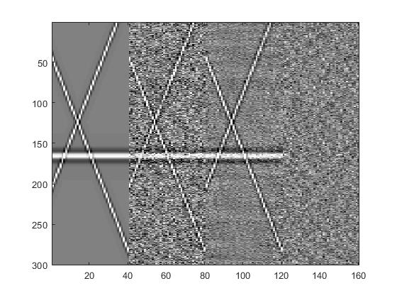

# Singular-Spectrum-Analysis

https://github.com/kiyoxi2020/Singular-Spectrum-Analysis.git

## SSA方法介绍

> Sacchi, M. D. (2009). FX singular spectrum analysis. CSPG CSEG CWLS Convention.

- Singular Spectrum Analysis （SSA）奇异谱分析，一种基于Hankel矩阵的特征谱分解方法

- 考虑一个二维信号，该信号由一个相同的一维波形经过时间方向的固定偏移形成，即有一个固定的倾角，该信号的时域（TX）、频域（FX）表示写作：

  
  $$
  s(t,x)=w(t-px)\Leftrightarrow S(\omega,x)=W(\omega)e^{-i\omega px}
  $$
  

  **考虑一个固定频率（$\omega$ ）、均匀采样（$x=(k-1)\Delta x$）的数据**，该数据的FX域表示为（为便于表示，省略$\omega$）：
  $$
  S_n=We^{-i\alpha n}
  $$
  其中，$\alpha=\omega p\Delta x$，对于**任意两个相邻道**，可以得到递推关系：
  $$
  S_n=PS_{n-1}
  $$

- 上式假设信号在空间是可预测的，可以构建Hankel矩阵：
  $$
  M=\left(\begin{matrix}S_1&S_2&S_3&S_4\\ S_2&S_3&S_4&S_5\\S_3&S_4&S_5&S_6\\S_4&S_5&S_6&S_7\end{matrix}\right)
  $$
  将递推式代入，可得：
  $$
  M=\left(\begin{matrix}S_1&PS_1&P^2S_1&P^3S_1\\ PS_1&P^2S_1&P^3S_1&P^4S_1\\P^2S_1&P^3S_1&P^4S_1&P^5S_1\\P^3S_1&P^4S_1&P^5S_1&P^6S_1\end{matrix}\right)
  $$
  

  易见，以上矩阵的秩为$r=1$，通过上述操作，我们得到了一个降秩后的矩阵。同理可得，若有$L$种偏移方式，则矩阵的秩应为$r=L$，因此可以通过SVD分解对上式进行降秩：
  $$
  \hat{M}=\sum_{k=1}^L \lambda_k u_k v_k^H
  $$
  

  即取前$L$个特征值实现矩阵降秩，再基于降秩矩阵进行重构即可实现对原始信号的重构。

- 最后沿逆对角线方向进行均值滤波：
  $$
  \hat{s}=A(\hat{M})
  $$
  

  其中，算子$A$表示沿着逆对角线方向对降秩后的Hankel矩阵$\hat{M}$进行均值滤波

  

## Matlab运行结果

- 运行main_denoise_2d.m即可实现基于SSA的去噪，结果如下所示：

从左至右分别为：干净信号、有噪信号、去噪结果、去除噪声
